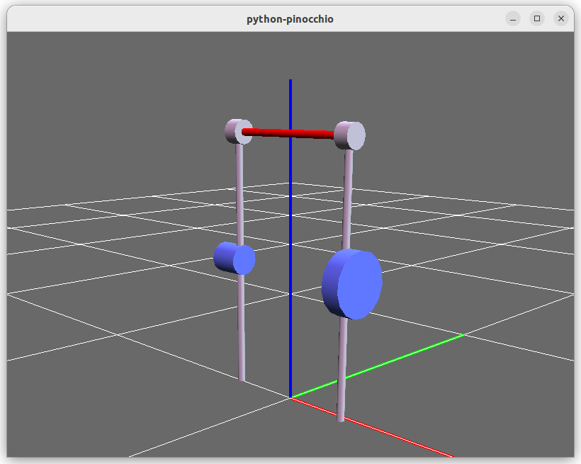
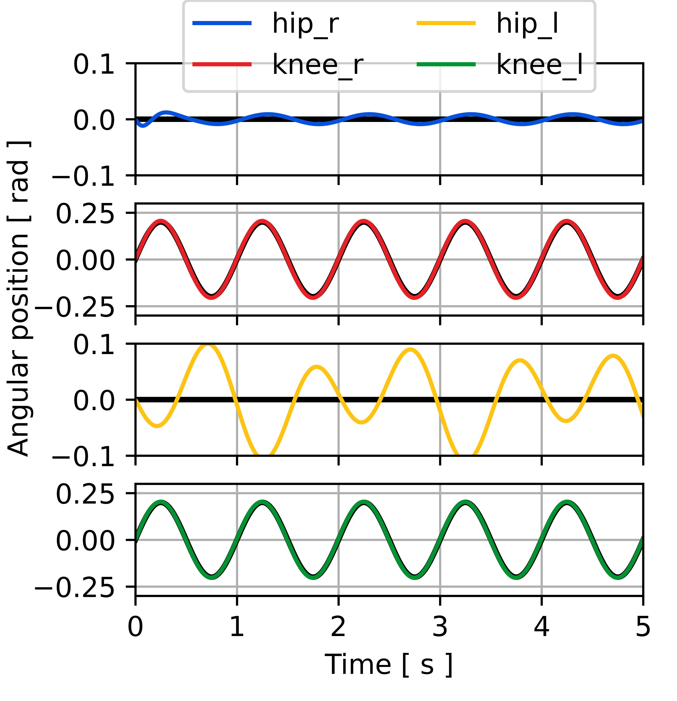
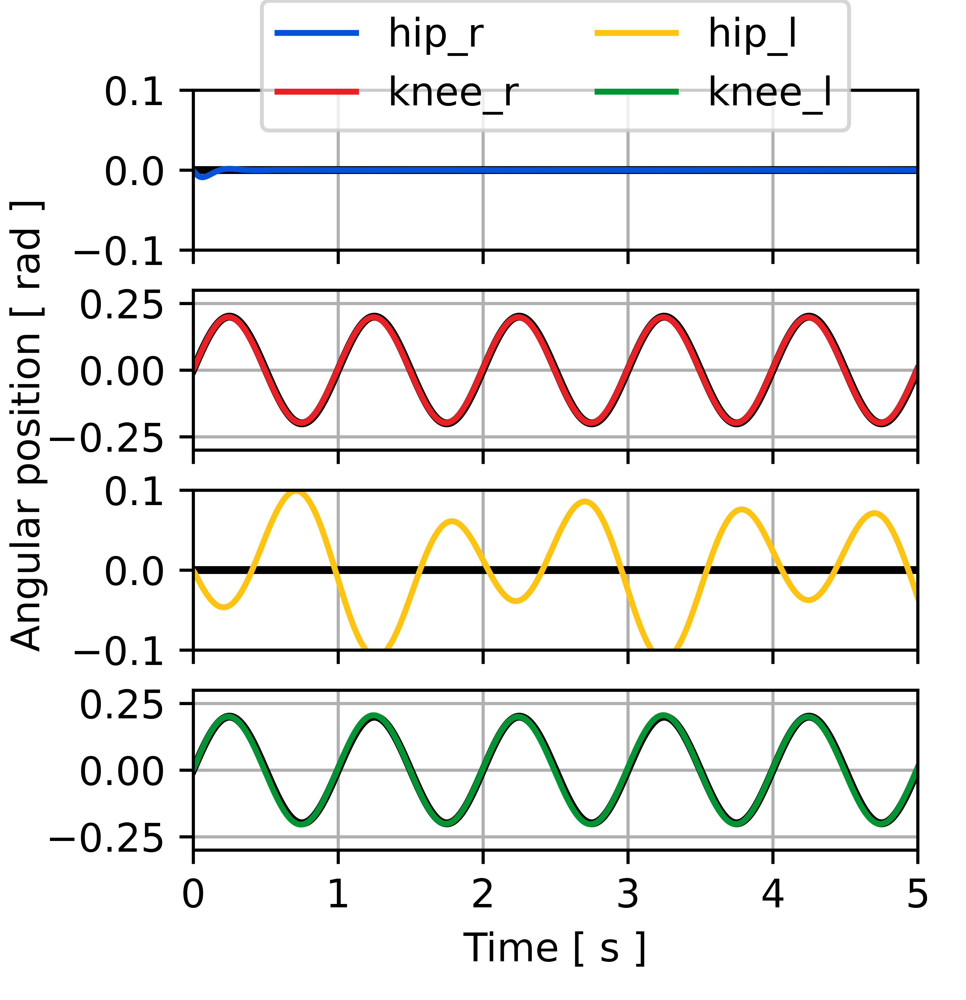

#  Gait-event-based interaction control method applied to an lower-limb exoskeleton

## Entregavel 1 : Artigo
## José Yecid Moreno Villamizar : 11195127

---

O modelo dinâmico está sendo obtido com o uso da biblioteca **Pinocchio**. Sesta forma é possível obter as matrizes dinâmicas levando em consideração os parâmetros caraterísticos. Na Fig. 1 pode se ver o modelo URDF desenvolvido, é visualizado usando pandas3D. Todo foi desenvolvido usando Python.

As figuras 2, 3 e 4 apresentam respostas temporais do sistema para diferentes arquiteturas de controle de torque, em ambas as juntas do joelho, nesta configuração a junta do quadril direito foi considerada ativa, em quanto a direita passiva, com o objetivo de visualizar diferentes comportamentos quando se tem atuação no quadril.

